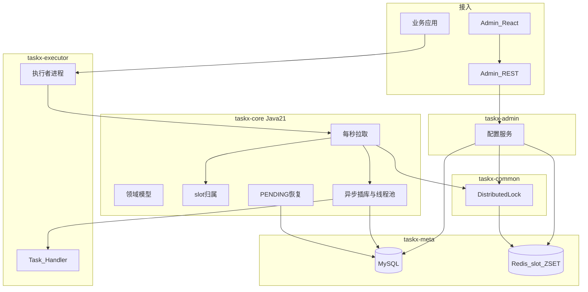
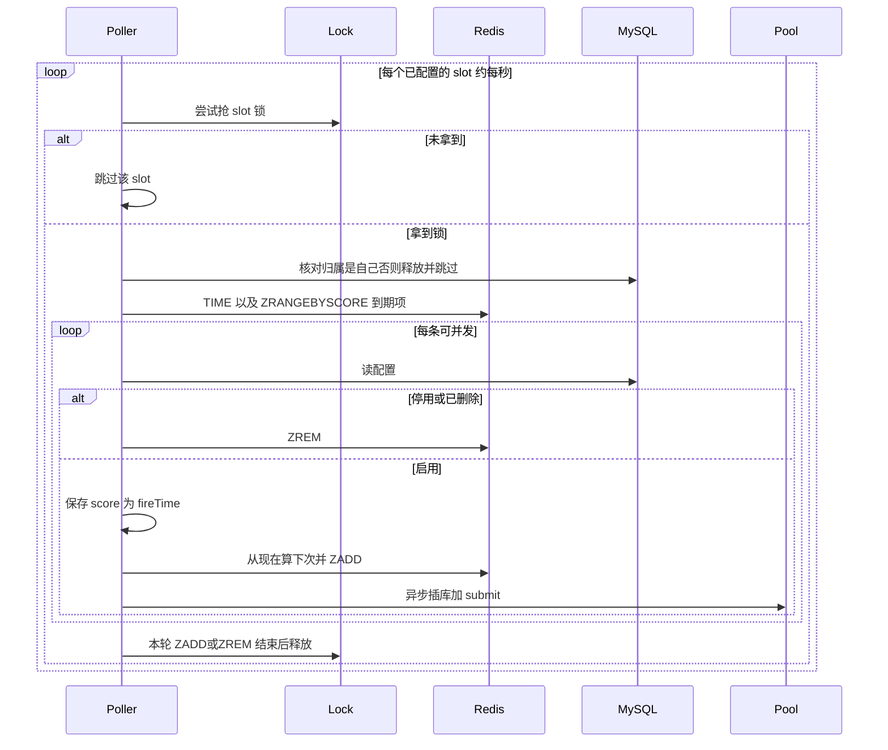

# 02 架构

## 逻辑视图

## 模块

- **taskx-common**：通用能力，无 Spring / 存储客户端。当前含分布式锁 SPI（`tryLock(key)`；测试内存实现，生产 Redisson 在 meta）。
- **taskx-core**：模型、下次时间（基于 Redis TIME 秒）、slot 规则、拉取循环、恢复循环、全量重建与迁 slot。无 Spring。不包含锁实现。
- **taskx-meta**：core 仓储的落地，**同时包含 MySQL 与 Redis**。MySQL：执行者、slot 归属、调度配置、执行记录、流程 JSON。Redis：`trigger:slot:{0..N-1}` ZSET、`DistributedLock` 的 Redisson 实现、`TIME`。配置写入时「未提交 MySQL + 写 Redis + 失败回滚」也放在本模块的协作里，避免拆成两个 storage 还要在上层拼事务边界。
- **taskx-admin**：Spring Boot REST；调用 core + meta 做配置 CRUD、全量重建、人工重跑。
- **taskx-executor**：独立进程，配置稳定执行者 ID 与负责的 slot 列表。
- **taskx-spring-boot-starter**：可选。
- **taskx-admin-ui**：React 管理台（Vite；开发时 `/api` 代理到 Admin REST）。

## 存储

**MySQL**

- 执行者：稳定 `executor_id`（配置必须提供）、心跳（仅观测）。
- **slot 归属**：`slot_no` 主键 → `executor_id`。启动时写入自己的 slot：被 **他人** 占用则进程退出；已是自己则重启。
- 调度配置（Task）、执行记录（含 `executor_id`、`scheduledFireTime`）、流程定义 JSON。

**Redis**

- ZSET key：`trigger:slot:{slotNo}`。member = `taskId`。score = Unix **秒**。
- now = Redis `TIME` 转到秒。`ZRANGEBYSCORE key 0 now`。
- slot 锁：key `lock:slot:{slotNo}`，与归属独立的运行时互斥，带 TTL，看门狗续期。默认 TTL 10s、看门狗 3s。

## 执行者

- 独立进程。启动 **必须** 有稳定 ID，否则失败。ID 用于任务行和 PENDING 恢复，**不用于** ZSET key。
- 启动时人工指定负责哪些 slot，写入归属表。
- 每个 slot 同时只应被一个执行者处理：表唯一 + 运行时锁。
- 宕机：其 slot 停止触发，等该进程带着原 ID 重启，或人工改归属后由新进程启动。
- 日常加机器：把部分 slot 改配给新人（先停旧拉取或持锁改表，见下）。不改变 `hash(taskId)%N`。

## 配置写入

1. 管理端对 `hash(taskId)%N` 抢 **slot 锁**。
2. MySQL `BEGIN`，写配置（未提交）。
3. 启用：按 Redis 当前时间算下次，`ZADD` 到对应 slot；停用/删除：`ZREM`。
4. Redis 失败 → `ROLLBACK`。成功再 `COMMIT`。
5. 若 COMMIT 失败而 Redis 已写：之后拉取查库无配置或停用则 `ZREM`。

## 从到期到执行

异步侧：插入 `(taskId, fireTime)`，冲突则跳过插入。`PENDING → RUNNING` CAS 成功才跑 Handler。submit 失败把该次标 `FAILED`。允许重叠：不同 fireTime 可以同时 RUNNING。

ZADD 已完成、异步 insert 尚未发生就崩溃：该次 **漏跑**。

## slot 锁

- 防两台误配同一 slot 同时拉；也给管理端改 Redis 用。
- `tryLock`：抢不到跳过，不阻塞其它 slot。
- 看门狗续期，直到本轮对该 slot 的同步 ZADD/ZREM 结束。
- 抢到后必须再读归属表。
- 人工改归属：应拿到该锁（或确认旧进程已停）再改表，然后旧进程下一轮核对归属会停拉。

## 恢复循环

- 只捞本 `executor_id` 的 **PENDING**。
- `RUNNING` 不自动重跑；人工接口执行滞留任务。
- 与触发循环可能同时看到同一 PENDING：CAS 决胜。

## 全量重建

维护窗口：停所有执行者 → 清空全部 slot ZSET → 按启用配置、Redis 当前时间算下次、`ZADD` 到 `hash%N` → 启动。改 N 也走这条路径并改归属表。
