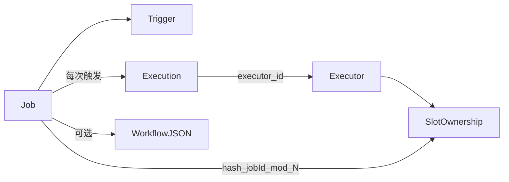

# 03 领域模型

## 实体关系



## Executor

- `executor_id`：来自环境变量/配置中心，启动必填，稳定。
- 心跳仅观测，不自动抢 slot。

## SlotOwnership

- `slot_no` 主键，`0 .. N-1`。
- `executor_id`：当前计划归属。

## Job

Handler、参数、启停。槽位由 `hash(jobId) % N` 计算，不写死在行上也可以缓存。停用/删除必须 `ZREM`（写入路径 + 拉取发现双保险）。

## Trigger

| 类型 | 下次 score 何时写 |
|------|-------------------|
| `CRON` / `FIXED_RATE` | 领取时同步 ZADD（从 **现在** 算） |
| `FIXED_DELAY` | 终态再写；领取时先移出到期 |
| `DELAY` / `ONCE` | 一般 ZREM，不再写回 |
| 编排入口 | 同普通 Trigger；内部推进见 [04](04-workflow.md) |

时间单位：**秒**。一律 Redis TIME。

## Execution

字段建议：`id`、`jobId`、`scheduledFireTime`、`executorId`、`status`。

唯一键 `(jobId, scheduledFireTime)`。

```text
PENDING --> RUNNING --> SUCCESS
                  \--> FAILED
PENDING --> FAILED     （submit 失败）
PENDING --> CANCELLED
```

- `PENDING → RUNNING` CAS 成功才执行。
- `RUNNING` 崩溃保持 RUNNING，不自动恢复。
- `PENDING` 仅原 `executorId` 的恢复循环可捞。

不依赖 JVM 任务 ID 缓存作为正确性前提。
